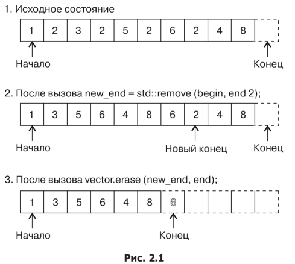

Контейнеры STL
===

### Примеры контейнеров:
* Непрерывные хранилища
    * *std::array*
    * *std::vector*
* Хранение списков
    * *std::list*
    * *std::forward_list*
* Деревья поиска
    * *std::set*
    * *std::map*
    * *std::multiset*
    * *std::multimap*
* Хеш-таблицы
    * *std::unordered_set*
    * *std::unordered_map*
    * *std::unordered_multiset*
    * *std::unordered_multimap*
* Адаптеры контейнеров
    * *std::stack*
    * *std::queue*
    * *std::priority_queue*

## Используем идиому erase-remove для контейнера *std::vector*
```cpp
#include <iostream>
#include <vector>
#include <algorithm>

int main () {
    std::vector <int> vec {1, 2, 3, 2, 5, 2, 6, 2, 4, 8};
    const auto new_end (std::remove (std::begin (vec), std::end (vec), 2));
    
    // Print vector
    for (const auto& item : vec) {
        std::cout << item << " ";
    }
    std::cout << std::endl;

    // Delete a set numbers
    const auto odd ([] (int i) { return i % 2 == 0l; });
    vec.erase (std::remove_if (std::begin (vec), std::end (vec), odd), std::end (vec));
    
    // Мы удалили чётные элементы, но ёмкость вектора осталась преждней. Изменим её
    vec.shrink_to_fit ();
    
    // Print vector
    for (const auto& item : vec) {
        std::cout << item << " ";
    }
    std::cout << std::endl;
}
```

В итоге получим результат:
```bash
$ ./main
1 3 5 6 4 8
6 4 8
```

### Как это работает



