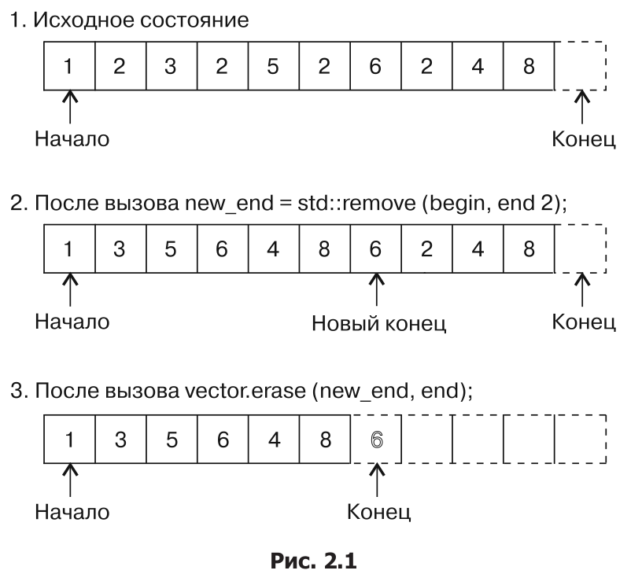
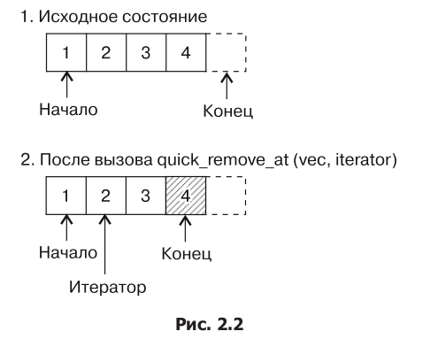
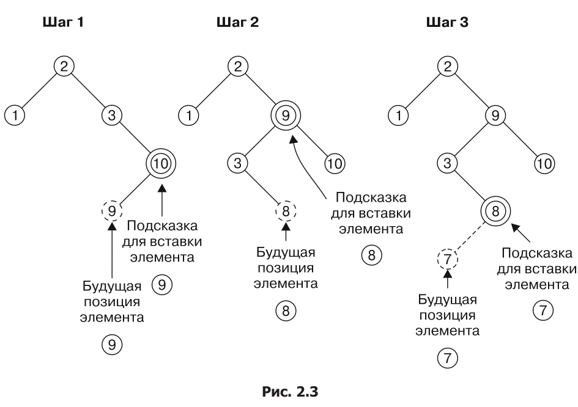

Контейнеры STL
===

### Примеры контейнеров:
* Непрерывные хранилища
    * *std::array*
    * *std::vector*
* Хранение списков
    * *std::list*
    * *std::forward_list*
* Деревья поиска
    * *std::set*
    * *std::map*
    * *std::multiset*
    * *std::multimap*
* Хеш-таблицы
    * *std::unordered_set*
    * *std::unordered_map*
    * *std::unordered_multiset*
    * *std::unordered_multimap*
* Адаптеры контейнеров
    * *std::stack*
    * *std::queue*
    * *std::priority_queue*

### Для удобства сразу введём перегрузку оператора *<<* для *std::vector*
```cpp
template <typename T>
std::ostream& operator << (std::ostream& os,
                           const std::vector <T>& vec) {
    auto begin = vec.cbegin ();
    const auto end = vec.cend ();
    if (begin == end) {
        return os;
    }
    
    os << *begin++;
    while (begin != end) {
        os << ", " << *begin++;
    }

    return os;
} // operator << (std::ostream& os, const std::vector <T>& vec)
```

## Используем идиому erase-remove для контейнера *std::vector*
```cpp
int main () {
    std::vector <int> vec {1, 2, 3, 2, 5, 2, 6, 2, 4, 8};
    const auto new_end (std::remove (std::begin (vec), std::end (vec), 2));
    
    std::cout << vec << std::endl;

    // Delete a set numbers
    const auto odd ([] (int i) { return i % 2 == 0l; });
    vec.erase (std::remove_if (std::begin (vec), std::end (vec), odd), std::end (vec));
    
    // Мы удалили чётные элементы, но ёмкость вектора осталась преждней. Изменим её
    vec.shrink_to_fit ();
    
    std::cout << vec << std::endl;
}
```

В итоге получим результат:
```bash
$ ./main
1, 3, 5, 6, 4, 8
6, 4, 8
```

### Как это работает


## Удаляем элементы из неотсортированного объекта класса std::vector за время O(1)

```cpp
template <typename T>
void quick_remove_at (std::vector<T> &vec,
                      std::size_t idx) {
    if (idx < vec.size ()) {
        vec[idx] = std::move (vec.back ());
        vec.pop_back();
    }
}

int main () {
    std::vector <int> vec {123, 456, 789, 100, 200};
    
    quick_remove_at (vec, 2);
    std::cout << vec << std::endl;
}
```

Также можно это реализовать и через интерфейс итераторов:
```cpp
template <typename T>
void quick_remove_at (std::vector<T> &vec,
                      typename std::vector<T>::iterator it) {
    if (it != std::end (vec)) {
        *it = std::move (vec.back ());
        vec.pop_back ();
    }
}
```

Результат:
```bash
$ ./main
123, 456, 200, 100
100, 456, 200
```

### Как это работает


## Получаем доступ к экземплярам класса *std::vector* быстрым или безопасным способом

* *Оператор []* - не делает проверку на выход за границы
* *Метод at ()* - делает проверку на выход за границы (при ошибке бросает исключение *std::out_of_range*)

## Сохраняем сортировку экземпляров класса *std::vector*
```cpp
std::template <typename T>
void insert_sorted (std::vector <T>& vec,
                    const T& value) {
    const auto insert_pos {std::lower_bound (std::begin (vec), std::end (vec), value)};
    vec.insert (insert_pos, value);
}

int main () {
    std::vector <std::string> vec {"some", "random", "words",
                                   "without", "order", "aaa",
                                   "yyy"};

    assert(false == std::is_sorted (std::begin (vec), std::end (vec)));
    std::sort (std::begin (vec), std::end (vec));
    assert(true == std::is_sorted (std::begin (vec), std::end (vec)));
    
    insert_sorted(v, "foobar");
    insert_sorted(v, "zzz");
    
    std::cout << vec << std::endl;
}    
```

```bash
$ ./main
aaa foobar order random some without words yyy zzz
```

Мы можем сделать эту функцию более универсальной: для *std::set* , *std::deque* , *std::list* и т. д!
```cpp
template <typename C, typename T>
void insert_sorted (C &c, const T &item) {
    const auto insert_pos {std::lower_bound (std::begin (c), std::end c), item)};
    c.insert (insert_pos, item);
}
```

## Вставляем элементы в контейнер *std::map* эффективно и в соответствии с условиями

Здесь достаточно самого важного только отрывка из примера, которые демонстрирует метод *try_emplace*:
```cpp
struct billionaire {
    string n    ame;
    double dollars;
    string country;
};

int main () {
    std::list <billionaire> billionaires { /* ... */ };
    std::map <std::string, std::pair <const billionaire, size_t>> m;
    
    for (const auto &b : billionaires) {
        auto [iterator, success] = m.try_emplace (b.country, b, 1);
        if (!success) {
            iterator->second.second += 1;
        }
    }
}
```

### Важно то, что *try_emplace* не будет создавать объект перед попыткой его вставить. *insert* и *emplace* так не могут.

## Исследуем **новую** семантику подсказок для вставки элементов с помощью метода std::map::insert
Мы можем подсказать *std::map* куда должен вставиться элемент, передав итератор на следующий за вставленным элемент.
#### Правильная подсказка будет указывать на существующий элемент, чье значение превышает значение вставляемого элемента, чтобы новый элемент занял позицию прямо перед ней.
```cpp
int main () {
    std::map <std::string, std::size_t> m {{"b", 1}, {"c", 2}, {"d", 3}};
    
    auto insert_it {std::end (m)};
    for (const auto& s : {"z", "y", "x", "w"}) {
        insert_it = m.insert (insert_it, {s, 1});
    }
    
    // Демонстраци того, как НЕ нужно подсказывать
    m.insert (std::end (m), {"a", 1});
    
    for (const auto& [key, value] : m) {
        std::cout << "\"" << key << "\": " << value << ", ";
    }
    std::cout << '\n';
}
```

```bash
$ ./main
"a": 1, "b": 1, "c": 2, "d": 3, "w": 1, "x": 1, "y": 1, "z": 1,
```

#### Стоит не забывать, что даже с правильной подсказкой, после вставки может произойти *перебалансировка* дерева.


## Эффективно изменяем ключи элементов *std::map*

### Функция *extract* — новая возможность *С++17*. Она удаляет элементы из массива, притом не вызывая побочных эффектов, связанных с выделением памяти.
```cpp
template <typename M>
void print (const M &m) {
    cout << "Race placement:" << std::endl;
    for (const auto &[placement, driver] : m) {
        std::cout << placement << ": " << driver << std::endl;
    }
}

int main () {
    std::map <int, std::string> race_placement {
        {1, "Mario"}, {2, "Luigi"}, {3, "Bowser"},
        {4, "Peach"}, {5, "Yoshi"}, {6, "Koopa"},
        {7, "Toad"}, {8, "Donkey Kong Jr."}
    };
    print (race_placement);
    
    {
        auto a (race_placement.extract(3));
        auto b (race_placement.extract(8));
        swap (a.key (), b.key ());
    }
    print (race_placement);
```

```bash
$ ./mapnode_key_modification
Race placement:
1: Mario
2: Luigi
3: Bowser
4: Peach
5: Yoshi
6: Koopa
7: Toad
8: Donkey Kong Jr.
Race placement:
1: Mario
2: Luigi
3: Donkey Kong Jr.
4: Peach
5: Yoshi
6: Koopa
7: Toad
8: Bowser
```

#### Элементы, извлечнные из ассоциативного массива, довольно гибкие. Их можно извлечь из *std::map* и вставить в *std::multimap*. Аналогично *std::set* и *std::multiset*, *std::unordered_map* и *std::unordered_map*, *std::unordered_set* и *std::unordered_set*.

## Применяем контейнер *std::unordered_map* для пользовательских типов

Чтобы использовать наш тип в *std::unordered_map*, нужно выбрать *хеш-функцию* и реализовать *operator ==* для нашего типа.
```cpp
struct coord {
    int x;
    int y;
};

bool operator == (const coord &l, const coord &r) {
    return l.x == r.x && l.y == r.y;
}

namespace std {
template <>
struct hash <coord> {
    using argument_type = coord;
    using result_type = size_t;
    
    result_type operator()(const argument_type &c) const {
    return static_cast <result_type >(c.x)    
         + static_cast <result_type> (c.y);
    }
}

int main () {
    std::unordered_map <coord, int> m {{{0, 0}, 1},
                                       {{0, 1}, 2},
                                       {{2, 1}, 3}};
    for (const auto& [key, value] : m) {
        std::cout << "{(" << key.x << ", " << key.y
                  << "): " << value << "} ";
    }
    std::cout << std::endl;
}
```

```bash
$ ./custom_type_unordered_map
{(2, 1): 3} {(0, 1): 2} {(0, 0): 1}
```

## Отсеиваем повторяющиеся слова из пользовательского ввода и выводим их на экран в алфавитном порядке с помощью контейнера *std::set*

```cpp
int main () {
    std::set <std::string> s;
    std::istream_iterator <std::string> it {cin};
    std::istream_iterator <std::string> end;
    
    std::copy (it, end, std::inserter (s, s.end ()));
    for (const auto word : s) {
        std::cout << word << ", ";
    }
    std::cout << std::endl;
}
```

```bash
$ echo "a a a b c foo bar foobar foo bar bar" | ./program
a, b, bar, c, foo, foobar,
```

*std::inserter* принимает на вход контейнер и место, куда нужно начинать вставлять элементы. Эта функция возвращает итератор *std:insert_iterator*, который ведёт себя как итератор, но операция инкремента ничего с ним не делает, а при разыменовании и присваивании, объект добавляется в конец контейнера.

## Реализуем простой ОПН-калькулятор с использованием контейнера *std::stack*

Примечание: *ОПН* - обратная польская натация

```cpp
template <typename IT>
double evaluate_rpn (IT it, IT end) {
    std::stack <double> val_stack;
    
    auto pop_stack {[&val_stack] () {
        auto r {val_stack.top ()};
        val_stack.pop ();
        return r;
    }};
    
    std::map <std::string, double (*) (double, double)> os {
        {"+", [](double a, double b) { return a + b; }},
        {"-", [](double a, double b) { return a - b; }},
        {"*", [](double a, double b) { return a * b; }},
        {"/", [](double a, double b) { return a / b; }},
        {"^", [](double a, double b) { return pow(a, b); }},
        {"%", [](double a, double b) { return fmod(a, b); }}
    };
    
    for (; it != end; ++it) {
        stringstream ss {*it};
        
        if (double val; ss >> val) {
            val_stack.push(val);
        } else {
            const auto r {pop_stack ()};
            const auto l {pop_stacl ()};
            
            try {
                const auto& op {ops.at (*it)};
                const double result {op (l, r)};
                val_stack.push (result);                
            } catch (std::exception& exc) {
                throw std::invalid_argumnet (*it);
            }
        }

        return val_stack.top ();
    }
}
int main () {
    try {    
        cout << evaluate_rpn(istream_iterator<string>{cin}, {}) << std::endl;
    } catch (const invalid_argument &exc) {
        cout << "Invalid operator: " << e.what () << std::endl;
    }
}
```

```bash
$ echo "3 1 2 + * 2 /" | ./rpn_calculator
4.5
```

## Подсчитываем частоту встречаемости слов с применением контейнера *std::map*

```cpp
string filter_punctuation (const string& s) {
    const char *forbidden {".,:; "};
    const auto idx_start (s.find_first_not_of (forbidden));
    const auto idx_end (s.find_last_not_of (forbidden));
    return s.substr (idx_start, idx_end - idx_start + 1);
}

int main () {
    std::map <std::string, std::size_t> words;
    int max_word_len {0};
    
    std::stirng s;
    while (std::cin > s) {
        auto filtred {filter_punctuation (s)};
        max_word_len = std::man <int> (max_word_len, filtred.length ());
        ++words[filtred];
    }
    
    std::vector <std::pair <std::string, int>> word_counts;
    word_counts.reserve (words.size ());
    std::move (std::begin (words), std::end (words), std::back_inserter (word_counts));
    
    std::sort (std::begin (word_counts), std::end (word_counts),
               [] (const auto& a, const auto& b) {
                   return a.second > b.second;
               });
    std::cout << "# " << std::setw (max_word_len) << "<WORD>" << " #<COUNT>\n";
    for (const auto& [word, count] : word_counts) {
        std::cout << std::setw(max_word_len + 2) << word << " #"
                  << count << std::endl;
    }
}
```

```bash
$ cat lorem_ipsum.txt | ./word_frequency_counter
#  <WORD> #<COUNT>
    et    #574
    dolor #302
    sed   #273
    diam  #273
    sit   #259
    ipsum #259
```

## Вспомогательный стилистический редактор для поиска длинных предложений в текстах с помощью *std::multimap*

```cpp
string filter_ws (const string& s) {
    const char *ws {" \r\n\t"};
    const auto a (s.find_first_not_of (ws));
    const auto b (s.find_last_not_of (ws));
    if (a == string::npos) {
        return {};
    }
    return s.substr (a, b - a + 1);
}

std::multimap <std::size_t, std::string> get_sentence_stats (const std::string& content) {
    std::multimap <std::size_t, std::string> ret;
    const auto end_it (std::end (content));
    auto it1 (std::begin (content));
    auto it2 (std::find (it1, end_it, '.'));
    
    while (it1 != end_it && distance(it1, it2) > 0) {
        string s {filter_ws({it1, it2})};
        if (s.length() > 0) {
            const auto words (std::count (std::begin (s), std::end (s), ' ') + 1);
            ret.emplace (std::make_pair (words, std::move (s)));
        }

        it1 = std::next (it2, 1);
        it2 = std::find (it1, end_it, '.');
        
        if (it2 == end_it) {
            break;
        }
    }
    
    return ret;
}

int main () {
    std::cin.unsetf (std::ios::skipws);
    std::string content {std::istream_iterator <char> {std::cin}, {}};
    for (const auto & [word_count, sentence]
             : get_sentence_stats(content)) {
        cout << word_count << " words: " << sentence << "." << std::endl;
    }
}
```

```bash
$ cat lorem_ipsum.txt | ./sentence_length 1
...
10 words: Nam quam nunc, blandit vel, luctus pulvinar,
hendrerit id, lorem.
10 words: Sed consequat, leo eget bibendum sodales,
augue velit cursus nunc,.
12 words: Cum sociis natoque penatibus et magnis dis
parturient montes, nascetur ridiculus mus.
17 words: Maecenas tempus, tellus eget condimentum rhoncus,
sem quam semper libero, sit amet adipiscing sem neque sed ipsum.
```
### Хорошей оптимизацией было бы использовать *std::string_view*.


