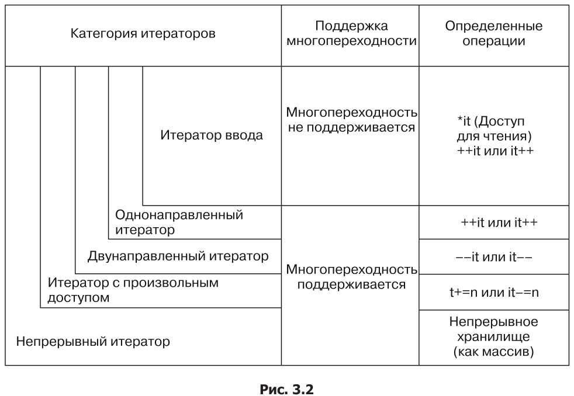
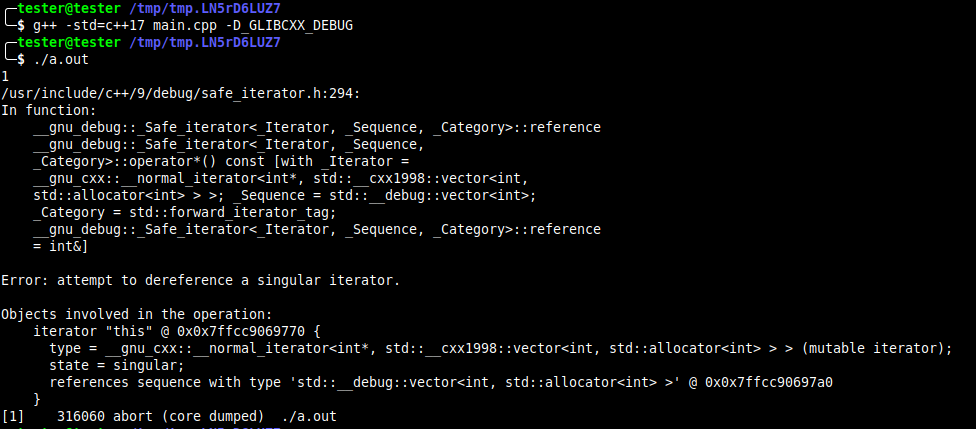
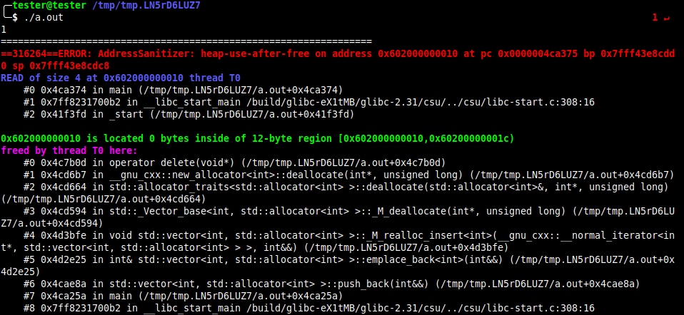

# Глава 3. Итераторы

## Категории итераторов



Примеры:
* Итераторы ввода: *std::istream_iterator*(после инкремента, предыдущее значение становится *недействительным*)
* Однонаправленные итераторы: *std::forward_list* (можно итерироваться много раз )
* Двунаправленные итераторы: у контейнеров *std::list*, *std::set* и *std::map*.
* Итераторы с произвольным доступом: у контейнеров *std::vector*, *std::deque* (можно перескакивать несколько значений сразу)
* Непрерывные итераторы: у контейнера *std::vector* (данные хранятся в непрерывной памяти)
* Итераторы вывода (используется только для записи данных, чтение не определено)
* Изменяемые итераторы

## Создаем собственный итерабельный диапазон данных

### Примитивный итератор
```cpp
class num_iterator {
    int i;
    
public:  
    explicit num_iterator (int position = 0) :
        i {position}
    {}
    
    int operator* () const { return i; }
    num_iterator& operator++ () {
        ++i;
        return *this;
    }
    bool operator != (const num_iterator& other) const {
        return i != other.i;
    }
};
```

### Теперь класс, который возвращает диапазон чисел
```cpp
class num_range {
    int a, b;

public:
    num_range (int from, int to) :  
        a {from},
        b {to}
    {}
    
    num_iterator begin () const { return num_iterator {a}; }
    num_iterator end   () const { return num_iterator {b}; }
};
```

### Итерируемся
```cpp
int main () {
    for (int i : num_range {100, 110}) {
        std::cout << i << ", ";
    }
    
    std::cout << std::endl;
}
```

```bash
$ ./main
100, 101, 102, 103, 104, 105, 106, 107, 108, 109,
```

## Обеспечиваем совместимость собственных итераторов с категориями итераторов *STL*


Давайте напишем свой итератор и применим его в функции std::minmax_element:
```cpp
class num_iterator {
    int i;
public:
    explicit num_iterator (int position = 0) : i {position} {}
    int operator*() const { return i; }
    num_iterator& operator++() {
        ++i;
        return *this;
    }
    bool operator!=(const num_iterator &other) const {
        return i != other.i;
    }
    bool operator==(const num_iterator &other) const {
        return !(*this != other);
    }
};
class num_range {
    int a;
    int b;
    public:
    num_range(int from, int to)
    : a{from}, b{to}
    {}
    num_iterator begin() const { return num_iterator{a}; }
    num_iterator end()
    const { return num_iterator{b}; }
};

using namespace std;

int main () {
    num_range r {100, 110};
    auto [min_it, max_it] (minmax_element(begin(r), end(r)));
    cout << *min_it << " - " << *max_it << '\n';
}
```


Но при компиляции мы получим ошибку. Функци *STL* *std::min_max_element* запрашивает поведение итератор. Т.е. какие типы он итерирует и какого типа сам итератор. Напишем это:
```cpp
namespace std {
template <>
struct iterator_traits <num_iterator> {
    using iterator_category = std::forward_iterator_tag;
    using value_type = int;
};
}
```

В итоге всё скомпилируется:
```bash
100 - 109
```

#### Начиная с *С++17* не рекомендуется наследовать свой итератор от *std::iterator <...>*.

## Используем *оболочки итераторов* для заполнения обобщённых структур данных

* *std::back_insert_iterator*
* *std::front_insert_iterator*
* *std::insert_iterator*
* *std::istream_iterator*
* *std::ostream_iterator*

```cpp
int main () {
    istream_iterator <int> it_cin {cin};
    istream_iterator <int> end_cin;
    
    deque <int> v;
    
    // Считаем std::cin в v
    copy (it_cin, end_cin, back_inserter (v));
    
    // Скопируем следующие элементы в середину v
    istreamstring sstr {"123 456 789"};
    auto deque_middle (next (begin (v), static_cast <int> (v.size () / 2)));
    copy (istream_iterator <int> {sstr}, {}, inserter (v, deque_middle));
     
    // Вставим в начало очереди
    initializer_list <int> il {-1, -2, -3};
    copy (begin (il2), end (il2), front_inserter (v));
    
    // Выводим
    copy (begin (v), end (v), ostream_iterator <int> {cout, ", "});
    cout << endl;
}    
```

```bash
$ echo "1 2 3 4 5" | ./main
-3, -2, -1, 1, 2, 123, 456, 789, 3, 4, 5,
```

## Реализуем алгоритмы с помощью итераторов
Итераторы по последовательности фибоначи:
```cpp
class fibit {
    size_t i {0};
    size_t a {0};
    size_t b {1};

public:
    fibit () = default;
    explicit fibit (size_t i) :
        i (i)
    {}
    
    size_t operator* () const {
        return b;
    }
    
    fibit& operator ++ () {
        const size_t old_b = b;
        b = a + b;
        a = old_b;
        ++i;
        return *this;
    }
    
    bool operator != (const fibit& other) const {
        return i != other.i;
    }
};

class fib_range {
    size_t end_n;

public:
    fib_range (size_t end_n) :
        end_n (end_n)
    {}
    
    fibit begin () const { return fibit {}; }
    fibit end ()   const { return fibit {end_n}; }
};

int main () {
    for (size_t i : fib_range (10)) {
        cout << i << ", ";
    }
    cout << endl;
}
```

## Перебор в обратную сторону с применением обратных адаптеров для итераторов
```cpp
int main () {
    list <int> l {1, 2, 3, 4, 5};
    
    copy (l.rbeing (), l.rend (), ostream_iterator <int> {cout, ", "});
    cout << endl;
    
    copy (make_reverse_iterator (end (l)),
          make_reverse_iterator (begin (l)),
          ostream_iterator <int> {cout, ", "});
    cout << endl;
```
Одинаковый результат:
```bash
5, 4, 3, 2, 1,
5, 4, 3, 2, 1,
```

## Завершение перебора диапазона данных с использованием ограничений
### Начиная с *C++17* начальный и конечный итераторы не обязаны иметь один тип
```cpp
// Самое важное
class cstring_iterator_sentinel {};

class cstring_iterator {
    const char *s {nullptr};

public:
    explicit cstring_iterator (const char* str) :
        s {str}
    {}
    
    char operator* () const { return *s; }    
    cstring_iterator& operator ++ () {
        ++s;
        return *this;
    }    
    bool operator != (const cstring_iterator_sentinel) const {
        return s != nullptr && *s != '\0';
    }
};

class cstring_range {
    const char* s {nullptr};

public:
    cstring_range (const char* str) :
        s {str}
    {}
    
    cstring_iterator begin () const { return cstring_iterator {s}; }
    cstring_iterator_sentinel end () const { return {}; }
};

int main (int argc, char* argv[]) {
    if (argc < 2) {
        return 0;
    }
    
    for (char c : cstring_range {argv[1]}) {
        cout << c;
    }
    cout << endl;
}
```

## Автоматическая проверка кода итераторов с помощью проверяемых итераторов
### Реализация *GNU STL* имеет *режим отладки*, а компиляторы *GNU C++* и *LLVM clang C++* поддерживают дополнительные библиотеки для создания *сверхчувствительных* и *избыточных* бинарных файлов, которые будут мгновенно сообщать и большинстве ошибок.
Рассмотрим пример, в котором мы обращаемся к провисшему итератору:
```cpp
    int main () {
        std::vector <int> v {1, 2, 3};
        v.shrink_to_fit ();
        const auto it {std::begin (v)};
        
        // Здесь всё хорошо
        std::cout << *it << std::endl;
        
        // Здесь точно будет выделение памяти и итератор может провиснуть
        v.push_back (123);
        std::cout << *it << std::endl;
    }
```

Выполним:
```bash
$ ./main
1
0
```

Теперь добавим флаги компиляции:
* для *gcc*  *-D_GLIBCXX_DEBUG*
* для *clang* *-fsanitize=address -fsanitize=undefined*

Теперь программа выдаёт точное описание проблемы:



### Средства очистки помогают обнаружить различные баги, например:
* Выход за пределы диапазона
* Использование после освобождения
* Переполнение переменной типа *int*
* Выравнивание указателя

## Создаем собственный адаптер для итераторов-упаковщиков
```cpp
class zip_iterator {
    using it_type = std::vector <double>::iterator;
    it_type it1, it2;

public:
    zip_iterator (it_type iterator1, it_type iterator2) :
        it1 (iterator1),
        it2 (iterator2)
    {}
    
    zip_iterator& operator ++ () {
        ++it1;
        ++it2;
        return *this;
    }

    zip_iterator operator ++ (int) {
        auto tmp {*this};
        operator ++ ();
        return tmp;
    }
    
    bool operator != (const zip_iterator& rhs) const {
        return it1 != rhs.it1 && it2 != rhs.it2;
    }
    bool operator == (const zip_iterator& rhs) const {
        return !operator != (rhs);
    }
    
    std::pair <double&, double&> operator * () const {
        return {*it1, *it2};
    }
};

namespace std {
template <>
struct iterator_traits <zip_iterator> {
    using iterator_category = std::forward_iterator_tag;
    using value_type = std::pair <double, double>;
    using difference_type = long int;
};
}

class zipper {
    using vec_type = std::vector <double>;
    vec_type& vec1;
    vec_type& vec2;

public:
    zipper (vec_type& va, vec_type& vb) :
        vec1 (va),
        vec2 (vb)
    {}
    
    zip_iterator begin () const {
        return zip_iterator {std::begin (vec1), std::begin (vec2)};
    }
    
    zip_iterator end () const {
        return zip_iterator {std::end (vec1), std::end (vec2)};
    }

    int main () {
        using namespace std;
        vector <double> a {1.0, 2.0, 3.0};
        vector <double> b {4.0, 5.0, 6.0};
        
        const auto add_product {[] (double sum, double auto& p) {
            return sum + p.first * p.second;
        }};
        
        zipper zipped {a, b};
        
        const auto dot_product {accumulate (
            begin (zipped), end (zipped), 0.0, add_product
        )};
        
        cout << dot_product << endl;
    }
};

```

```bash
$ ./main
32
```

### Дополнение
В библиотеке *Boost* уже реализован в общем виде *zip_iterator*.

Также в *STL* есть *std::valarray*:
```cpp
int main () {
    std::valarray <double> a {1.0, 2.0, 3.0};
    std::valarray <double> b {4.0, 5.0, 6.0};
    std::cout << (a * b).sum () << std::endl;
}
```

### Библиотека *ranges*
К сожалению эта библиотека не попала в стандарт *C++17*.  Рассмотрим её элегантность:
1. Сумма квадратов от 1 до 10
```cpp
const int sum = accumulate (view::ints (1),
                          | view::transform ([] (int i) { return i * i; })
                          | view::take (10), 0);
```
2. Фильтрация всех чётных чисел и преобразование остальных в строки
```cpp
std::vector <int> c {1,2,3,4,5,6,7,8,9,10};
auto rng = v | view::remove_if ([] (int i) {return i % 2 == 0;})
             | view::transform ([] (int i) {return std::to_string (i);});
// rng == {"2"s,"4"s,"6"s,"8"s,"10"s};
```


