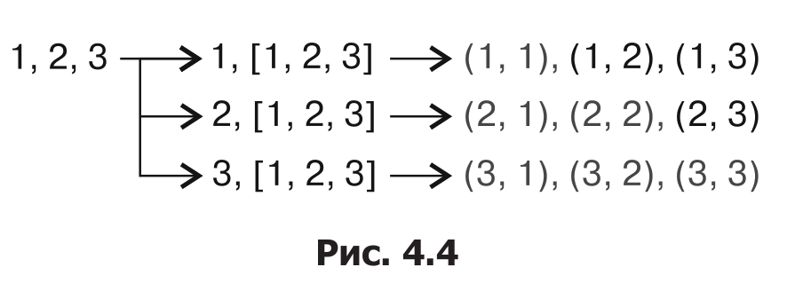

Глава 4. Лямбда-выражения
===

## Динамическое определение функций с помощью лямбда-выражений

*Лямбда-выражения* или *лямбда-функции* создают **замыкания**. **Замыкание** - очень обобщённый термин для *безымянных объектов*, которые можно вызвать как функции.


### Круглые скобки в *лямбда-выражениях* являются необязательными:
```cpp
auto just_ont ( [](){ return 1; });
auto just_two ( []  { return 2; });
```

### Чтобы позволить менять замыканию собственные переменные, нужно использовать ключевое слово *mutable*
```cpp
auto counter (
    [count = 0] () mutable { return ++count; } 
);

// Также можно захватить по ссылке
int a {0};
auto incrementer ( [&a] { ++a; } );
```

### Каррирование
```cpp
auto plus ([] (auto l, auto r) {
    return l + r;
});

auto plus_ten ([plus] (int x) {
    return plus (10, x);
});
```

### Лямбда-выражение:
```cpp
[список захвата] (параметры)
    mutable             (необязательный)
    constexpr           (необязательный)
    exceptionattr       (необязательный)
    -> возвращаемый тип (необязательный)
{
    тело
}
```
### Список захвата
    * *[a, &b] () {...}* — копируем **a** и берем ссылку на **b**
    * *[&, a] () {...}* — копируем **a** и применяем ссылку на **любую** другую переданную переменную
    * *[=, &b, i{22}, this] () {...}* — получаем ссылку на **b** , копируем значение **this**, инициализируем новую переменную **i** значением *22* и копируем любую другую использованную переменную

### *mutable*
    *  Если объект функции должен иметь возможность модифицировать получаемые им переменные путем копирования **( [=] )**, то его следует определить как *mutable* . Это же касается вызова неконстантных методов захваченных объектов.
### *constexpr*
    * Компилятор проверяет критерии на *constexpr*
    * Если лямбда не *constexpr*, но при этом соответствует всем критериям *constexpr*, то она может стать *constexpr* **неявно**

## Добавляем полиморфизм путем оборачивания лямбда-выражений в *std::function*
```cpp
static auto consumer (auto& container) {
    return [&] (auto value) {
        container.push_back (value);
    }
}

static void print (const auto& c) {
    for (const auto& i : c) {
        std::cout << i << ", ";
    }
    std::cout << std::endl;
}

int main () {
    std::vector <int> v;
    std::deque <int> d;
    std::list <int> l;
    
    const std::vector <std::function <void (int)>> consumers {
        consumer (v), consumer (d), consumer (l)
    };
    
    for (std::size_t i {0}; i < 10; ++i) {
        for (auto&& consume : consumers) {
            consume (i);
        }
    }
    
    print (v);
    print (d);
    print (l);
}
```

```bash
$ ./std_function
0, 1, 2, 3, 4, 5, 6, 7, 8, 9,
0, 1, 2, 3, 4, 5, 6, 7, 8, 9,
0, 1, 2, 3, 4, 5, 6, 7, 8, 9,s
```

Тип лямбды зависит от того, что она захватила, но *std::function* обобщает функции типа *void (int)*.

Если размер лямбды мал, что *std::function* будет её хранить в себе, иначе он выделит фрагмент памяти в куче.

## Создаём функции методом конкатенации
```cpp
template <typename T, typename... Ts>
auto concat (T t, Ts... ts) {
    if constexpr (sizeof... (Ts) > 0) {
        return [=] (auto... params) {
            return t (concat (ts...) (params...));
        };
    } else {
        return t;
    }
}

int main () {
    auto twice  ([] (int i) { return 2 * i; });
    auto thrice ([] (int i) { return 3 * i; });
    
    auto combined (
        concat (twice, thrice, std::plus <int> {})
    );
    
    std::cout << combined (2, 3) << std::endl;
}
```
```bash
$ ./concatenation
30
```

## Создаем сложные предикаты с помощью логической конъюнкции
```cpp
static bool begins_with_a (const std::string& s) {
    return s.find("a") == 0;
}
static bool ends_with_b (const std::string& s) {
    return s.rfind("b") == s.length() - 1;
}

template <typename A, typename B, typename F>
auto combine(F binary_func, A a, B b) {
    return [=] (auto param) {
        binary_func (a (param), b (param))
    };
}

int main () {
    auto a_xxx_b (combine (
        logical_and <> {},
        begins_with_a, ends_with_b));
    copy_if (istream_iterator <string> {cin}, {},
             ostream_iterator <string> {cout, ", "},
             a_xxx_b);
    cout << endl;
}
```

```bash
$ echo "ac cb ab axxxb" | ./combine
ab, axxxb,
```
* [](http://en.cppreference.com/w/cpp/utility/functional) - *std::logical_and*, *std::logical_or*

## Вызываем несколько функций с одинаковыми входными данными
```cpp
static auto multicall (auto... functions) {
    return [=] (auto x) {
        (void) std::initializer_list <int> {
            ((void) functions (x), 0)...
        };
    }
}

static void for_each (auto f, auto... xs) {
    (void) std::initializer_list <int> {
        ((void) f (xs), 0)...
    };
}

static auto brace_print (char a, char b) {
    return [=] (auto x) {
        std::cout << a << x << b << ", ";
    };
}

int main () {
    auto f (brace_print('(', ')'));
    auto g (brace_print('[', ']'));
    auto h (brace_print('{', '}'));
    auto nl ([](auto) { std::cout << '\n'; });
    
    auto call_fgh (multicall (f, g, h));
    for_each (call_fgh, 1, 2, 3, 4, 5);
}
```

```bash
$ ./multicaller
(1), [1], {1},
(2), [2], {2},
(3), [3], {3},
(4), [4], {4},
(5), [5], {5},
```

Данный приём *(void) std::initializer_list <int> {((void) functions (x), 0)...};* работает эффективно и явно говорит компилятору, что возвращаемые значения игнорируютя.

## Реализуем функцию *transform_if* с применением *std::accumulate* и *лямбда-выражений*
```cpp
template <typename T>
auto map (T fn) {
    return [=] (auto reduce_fn) { // reduce - свёртка
        return [=] (auto accum, auto input) {
            return reduce_fn(accum, fn(input));
        };
    };
}

template <typename T>
auto filter (T predicate) {
    return [=] (auto reduce_fn) {
        return [=] (auto accum, auto input) {
            if (predicate (input)) {
                return reduce_fn (accum, input);
            } else {
                return accum;
            }
        };
    };
}

int main () {
    std::istream_iterator <int> it {std::cin};
    std::istream_iterator <int> end_it;
    
    auto even  ([](int i) { return i % 2 == 0; });
    auto twice ([](int i) { return i * 2; });
    
    auto copy_and_advance ([] (auto it, auto input) {
        *it = input;
        return ++it;
    });
    
    std::accumulate (it, end_it,
        std::ostream_iterator <int> {std::cout, ", "},
        filter (even) (
            map (twice)(
                copy_and_advance
            )
    ));
    std::cout << std::endl;
}
```
```bash
$ echo "1 2 3 4 5 6" | ./transform_if
4, 8, 12,
```

### Чтобы понять, почему это работает, приведу реализацию *std::accumulate*:
```cpp
template <typename T, typename F>
T accumulate (InputIterator first, InputIterator last, T init, F f) {
    for (; first != last; ++first) {
        init = f (init, *first);
    }
    return init;
}
```

### Аналогично можно реализовать простейшим способом *transform*:
```cpp
template <typename InputIterator, typename OutputIterator,
          typename P, typename Transform>
OutputIterator transform_if (InputIterator first, InputIterator last,
                             OutputIterator out,
                             P predicate, Transform trans) {
    for (; first != last; ++first) {
        if (predicate(*first)) {
            *out = trans(*first);
            ++out;
        }
    }
    return out;
}
```

## Генерируем декартово произведение на основе любых входных данных во время компиляции
```cpp
static void print (int x, int y) {
    std::cout << "(" << x << ", " << y << ")" << std::endl;
}
int main () {
    constexpr auto call_cart (
        [=](auto f, auto x, auto ...rest) constexpr {
            (void) std::initializer_list <int> {
                (((x < rest)
                    ? (void) f (x, rest)
                    : (void) 0)
                 ,0)...
            };
        }
    );
    
    constexpr auto cartesian ([=] (auto ...xs) constexpr {
        return [=] (auto f) constexpr {
            (void) std::initializer_list <int> {
                ((void) call_cart (f, xs, xs...), 0)...
            };
        };
    });
    
    constexpr auto print_cart (cartesian(1, 2, 3));
    print_cart(print);
}
```
```bash
$ ./cartesian_product
(1, 2)
(1, 3)
(2, 3)
```

### Как это работает



